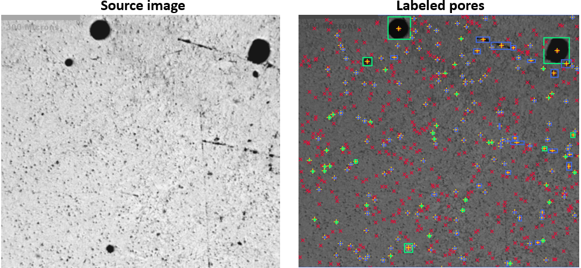
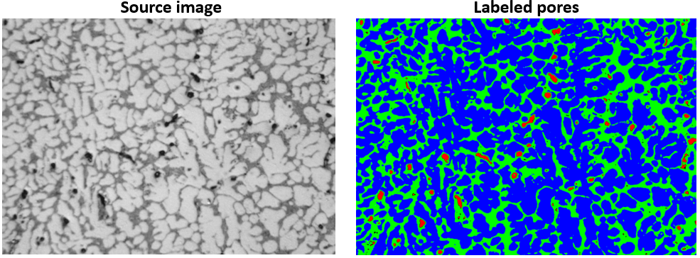

# Microstructure vision-based porosity analysis

## Large scale image (Aluminum, 300 microns)

  

**Input data:**

- Grayscale threshold = 60
- Minimum pore area = 50 px2
- Maximum pore area = 50000 px2
- Critical eccentricity = 0.6

**Output data:**

- Image area = 2595840 px2
- Pore area  = 36730 px2
- Pore fraction = 1.41%

- Total number of pores = 630
    - Number of circular pores = 45
    - Number of elliptical pores = 142
    - Number of ignored pores = 443
    - Total area of circular pores = 36730 px2
    - Total perimeter of circular pores = 2693 px
    - Median equivalent diameter of circular pores = 30 px
    - Mean eccentricity of circular pores = 0.48

## Small scale image (Aluminum, 30 microns)

  

**Input data:**

- Grayscale thresholds = [0…44; 45…84; 85…255]

**Output data:**

- Source image area = 3145728 px2
- Total 'dark' area = 45145.0 px2 (1.44%)
- Total 'mid' area = 919080.0 px2 (29.22%)
- Total 'light' area = 1899140.0 px2 (60.37%)

